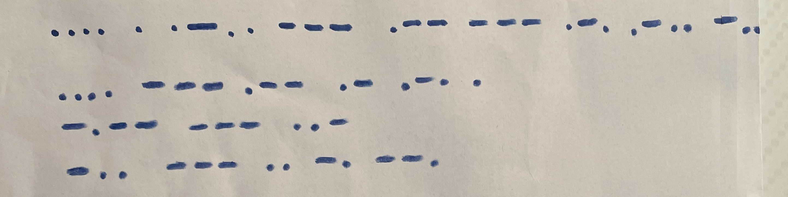
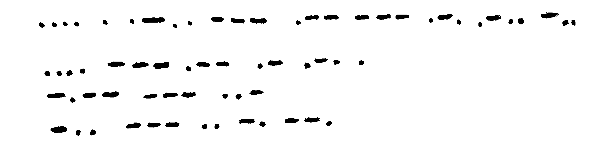
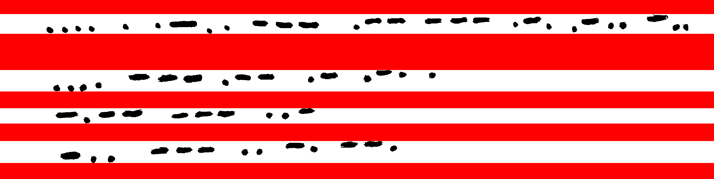
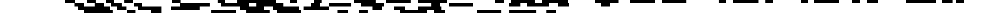
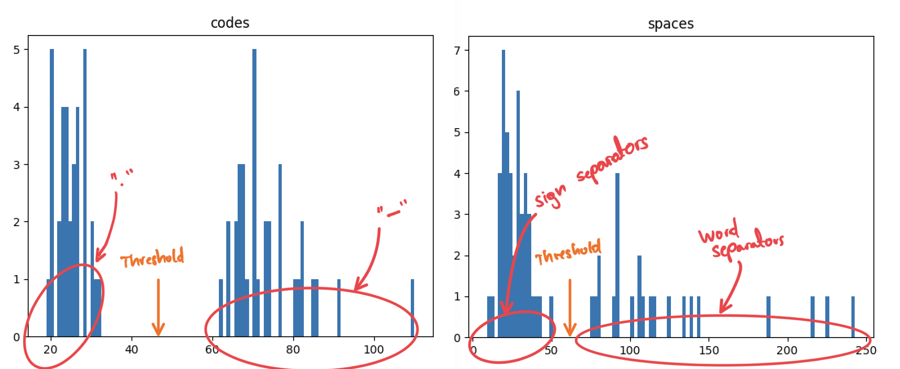

# ReMorse

Automatic image processing of hand-written morse code.

## About

Hand written morse code is not trivial to decode automatically. The dots and dashes are not perfectly aligned, and they vary in size.  
This program converts an input image of hand-written morse code to ascii.

## How it works

The program runs several phases, treating the original image:



 > Full disclaimer, the photo had some speckles of dust that I manually removed. That is, this image was slightly edited to make things work nicely.

 1) Adjust contrast: All pixels are set to full white or full black, based on a given threshold.  

 2) Detect lines: purely white lines are flagged and series of white lines used as separators for actual content.

 3) Pixel drop: For every line of actual content, the line is reduced to a 1D array. If any pixel in the given line's column is black, the array position is also black.

 4) Statistical analysis: All lines are analyzed and two distribution digrams are extracted. One for the sign lengths (anything that is black) and one for the break lenghts. The outcome is a overlap of two normal distirbutions, the saddle point is used to distinguish between `_` and `.`, likewise for character and word breaks.

 5) All lines are once more parsed. 
```
 .... . .-.. --- .-- --- .-. .-.. -..
 .... --- .-- .- .-. .
 -.-- --- ..-
 -.. --- .. -. --.
```
 6) And finally you can [use an online decoder](https://morsedecoder.com) to get back to latin:  
```
HELO WORLD HOW ARE YOU DOING
```

 > Looks like I'm not able to correctly spell "Hello" in morse code :)


## Project State

This is not a reliable / production ready implementation, but a proof of concept.

 * It does not always get every character right, but for my own purposes the outcome is good enough to decipher a hand-written longer message.
 * The code showcases hard coded magic values:
    * Threshold for contrast boost / distinguish black and white pixels.
    * Threshold for `.` / `_` distinction (currently manually extracted from visual distributions)

## Author

 * M.Schiedermeier ([m5c](https://github.com/m5c))
